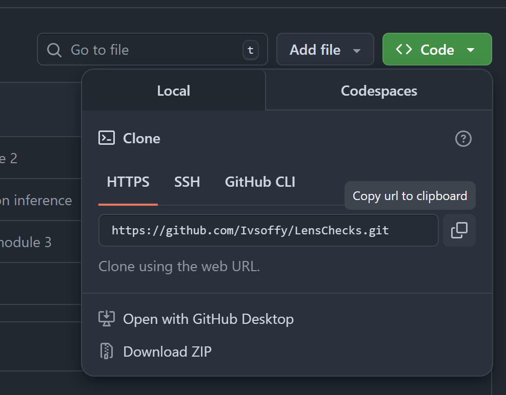

# LensChecks
Репозиторий, где собраны все компоненты модульной проверки анкет.

### Подготовка к использованию
Перед самым первым запуском необходимо:
1. Склонировать репозиторий LensCheck. Для этого можно нажать на Code -> Download ZIP и распаковать скачанный архив: 

2. Установить python (в идеале 3.13.5) и requirements.txt. Для этого набрать в терминале вашего IDE: \
```pip install -r requirements.txt```

### Инструкция
Запуск проверки состоит из двух шагов:
- Настрока config.yml
- Запуск start.py

### Config.yml
Здесь можно настроить параметры проверки.\
Общие параметры:

- module: 1,2,3,4 - Модуль для проверки
- input_folder: Директория с проверяемым файлом
- output_folder: Директория, куда будут помещены результаты проверки

Параметры для разных модулей:
- save_db_only_without_errors: True,False (1 модуль) - Сохранять анкету в базу данных, даже если в анкете присутствуют ошибки
- folder_past_year: (2,3 модули) - Директория с файлами прошлого года для подтягивания кодов и грейдов

### Демонстрация работы